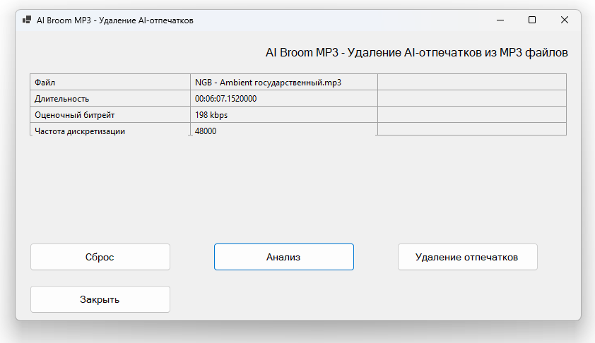

# AI Broom MP3



## Описание

**AI Broom MP3** — это приложение для анализа и очистки MP3-файлов от AI-отпечатков (водяных знаков), которые могут быть встроены в аудиофайлы при генерации музыки нейросетями.

## Возможности

- **Drag & Drop** — перетаскивание MP3-файлов прямо в окно приложения
- **Анализ аудио** — детекция AI-отпечатков с использованием FFT и STFT алгоритмов
- **Визуализация** — отображение информации о файле и результатах анализа
- **Очистка** — удаление обнаруженных AI-отпечатков из аудиофайла

## Технологии

- **NAudio** — библиотека для работы с аудио
- **NAudio.Lame** — кодирование MP3
- **FFT/STFT** — алгоритмы спектрального анализа

## Требования

- Windows 10/11
- .NET 8.0 или выше

## Сборка

```bash
cd AI_Broom_MP3
dotnet build
```

## Запуск

```bash
dotnet run
```

## Использование

1. Запустите приложение
2. Перетащите MP3-файл в окно программы
3. Нажмите кнопку анализа для проверки файла
4. При обнаружении AI-отпечатков используйте функцию очистки
