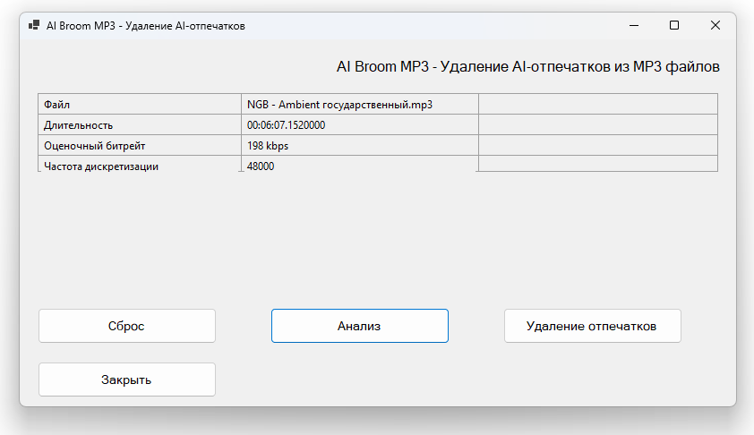

# AI Broom MP3




Приложение для анализа и очистки MP3-файлов от AI-отпечатков (водяных знаков), которые могут быть встроены в аудиофайлы при генерации музыки нейросетями.

## Возможности

- **Drag & Drop** — перетаскивание MP3-файлов прямо в окно приложения
- **Анализ аудио** — детекция AI-отпечатков с использованием FFT и STFT алгоритмов
- **Визуализация** — отображение информации о файле и результатах анализа
- **Очистка** — удаление обнаруженных AI-отпечатков из аудиофайла

## Технологии

- NAudio — библиотека для работы с аудио
- NAudio.Lame — кодирование MP3
- FFT/STFT — алгоритмы спектрального анализа

## Сборка

```bash
dotnet build
```

## Использование

1. Запустите приложение
2. Перетащите MP3-файл в окно программы
3. Нажмите кнопку анализа для проверки файла
4. При обнаружении AI-отпечатков используйте функцию очистки

## Лицензия

MIT License. Приложение сгенерировано нейросетями.
