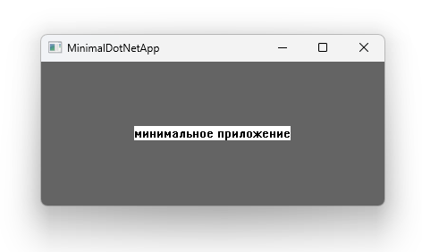
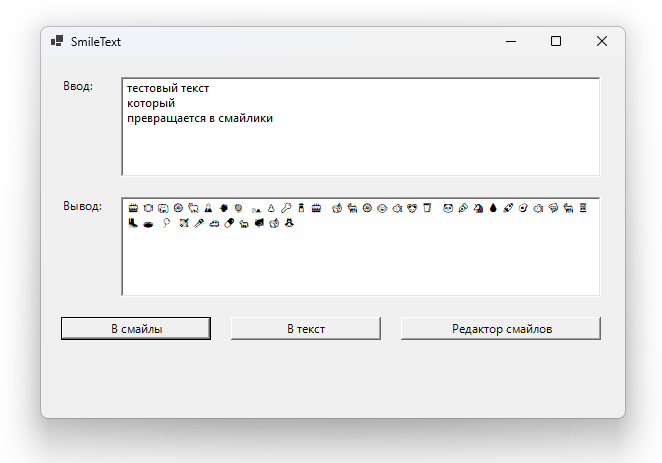

# FUNNY_CODE

AI-generated apps — коллекция приложений, созданных с помощью искусственного интеллекта.

## Проекты

### [AI Broom MP3](AI_Broom_MP3/)

Приложение для анализа и очистки MP3-файлов от AI-отпечатков (водяных знаков), которые могут быть встроены в аудиофайлы при генерации музыки нейросетями.

**Возможности:** Drag & Drop, анализ аудио с FFT/STFT, визуализация, очистка AI-отпечатков.

---

### [MinimalDotNetApp](MinimalDotNetApp/)

Минимальное Windows-приложение на .NET 8 с использованием Native AOT. Результат — один исполняемый файл размером ~970 КБ.

**Возможности:** Изменение размера окна, кнопка закрытия, перетаскивание за тело окна.

---

### [RandomRenamer](RandomRenamer/)

Windows Forms приложение для случайного переименования MP3-файлов с возможностью редактирования метаданных (автор и название).

**Возможности:** Drag & Drop, случайное переименование, редактирование метаданных, настраиваемый список имён.

---

### [SmileText](SmileText/)

Приложение для преобразования русского текста в последовательность эмодзи-смайлов и обратно. Каждая буква заменяется случайным смайлом из набора.

**Возможности:** Текст в смайлы и обратно, редактор смайлов, случайный выбор.

---

### [SystemMonitor](SystemMonitor/)

WPF-приложение для мониторинга системных ресурсов в реальном времени с современным интерфейсом и темной темой.

**Возможности:** Мониторинг CPU, памяти, сети, GPU и GPU-памяти с графиками истории.

---

### [UnrealHelperBatFiles](UnrealHelperBatFiles/)

Набор вспомогательных batch-файлов для работы с Unreal Engine проектами.

**Файлы:**
- `__BUILD.bat` — сборка проекта
- `__DEL_BINARIES.bat` — удаление бинарных файлов
- `__GEN_PROJECT_FILES.bat` — генерация файлов проекта
- `__Pack_Code_To_Text.bat` — упаковка кода в текст

---

## Требования

- Windows 10/11
- .NET 8.0+ (для большинства проектов)
- .NET 10.0 (для SystemMonitor)
