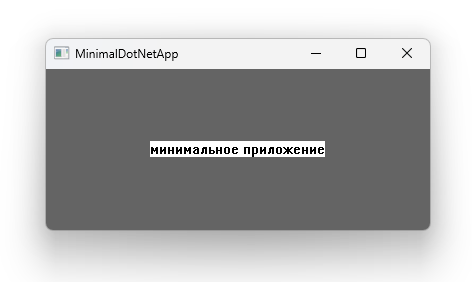
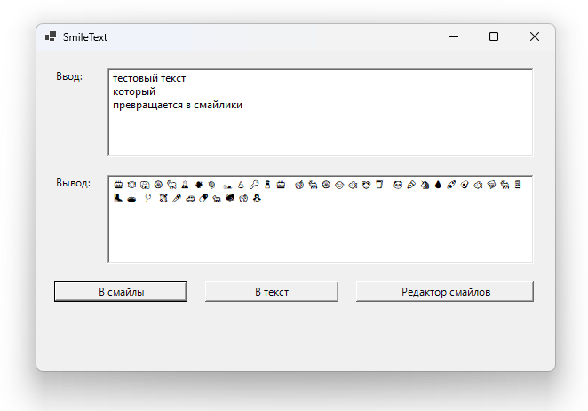
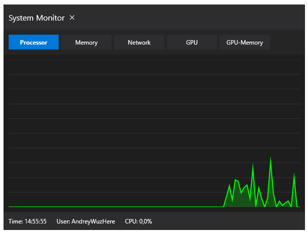
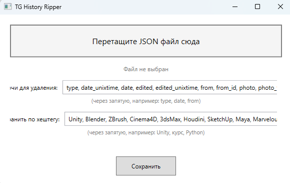
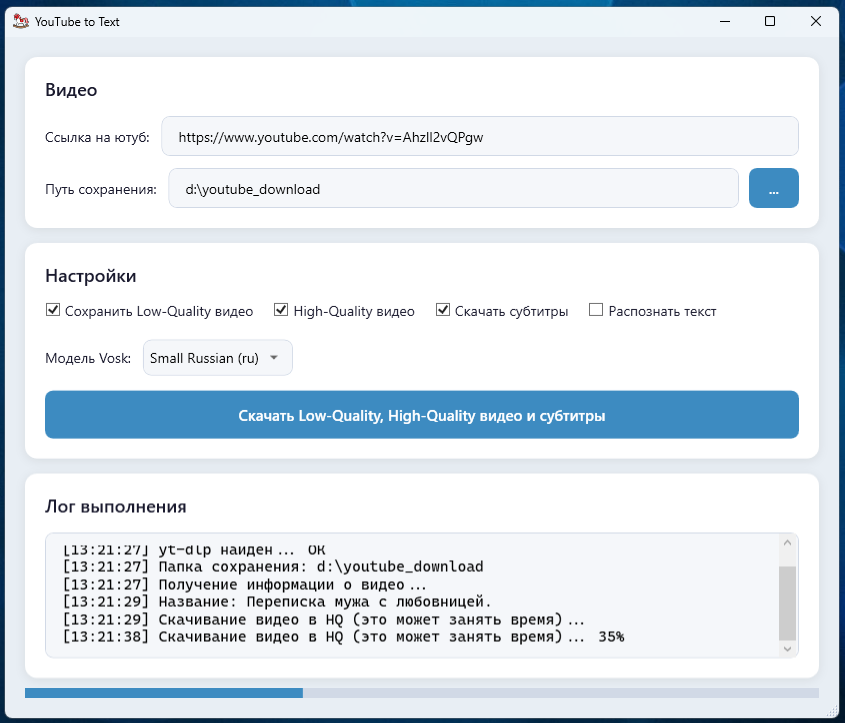

# FUNNY_CODE

Коллекция приложений, сгенерированных нейросетями.

## Проекты

### [AI Broom MP3](AI_Broom_MP3/)

Приложение для анализа и очистки MP3-файлов от AI-отпечатков (водяных знаков).

**Возможности:** Drag & Drop, анализ аудио с FFT/STFT, визуализация, очистка AI-отпечатков.

---

### [GenQRLite](GenQRLite/)

Генератор QR-кодов с минимальным интерфейсом.

**Возможности:** Генерация QR-кодов из текста, сохранение в файл.

---

### [MinimalDotNetApp](MinimalDotNetApp/)

Минимальное Windows-приложение на .NET 8 с Native AOT (~970 КБ).

**Возможности:** Изменение размера окна, кнопка закрытия, перетаскивание за тело окна.

---

### [RandomRenamer](RandomRenamer/)

Windows Forms приложение для случайного переименования MP3-файлов.

**Возможности:** Drag & Drop, случайное переименование, редактирование метаданных, настраиваемый список имён.

---

### [SmileText](SmileText/)

Приложение для преобразования русского текста в эмодзи-смайлы и обратно.

**Возможности:** Текст в смайлы и обратно, редактор смайлов, случайный выбор.

---

### [SystemMonitor](SystemMonitor/)

WPF-приложение для мониторинга системных ресурсов в реальном времени.

**Возможности:** Мониторинг CPU, памяти, сети, GPU и GPU-памяти с графиками истории.

---

### [TGHistoryRipper](TGHistoryRipper/)

WPF-приложение для извлечения и категоризации ссылок из экспорта истории чатов Telegram.

**Возможности:** Drag & Drop JSON, удаление полей, извлечение ссылок, экспорт по хештегам в Markdown.

---

### [UnrealHelperBatFiles](UnrealHelperBatFiles/)

Набор вспомогательных batch-файлов для работы с Unreal Engine проектами.

**Файлы:** `__BUILD.bat`, `__DEL_BINARIES.bat`, `__GEN_PROJECT_FILES.bat`, `__Pack_Code_To_Text.bat`

---

### [YTVtoText](YTVtoText/)

Приложение для скачивания видео с YouTube и распознавания текста из аудио через Vosk.

**Возможности:** Скачивание видео, распознавание речи, скачивание субтитров, сохранение в TXT.

---

## Требования

- Windows 10/11
- .NET 8.0+ (для большинства проектов)
- .NET 10.0 (для SystemMonitor)

## Лицензия

Все проекты распространяются под лицензией MIT. Приложения сгенерированы нейросетями.
