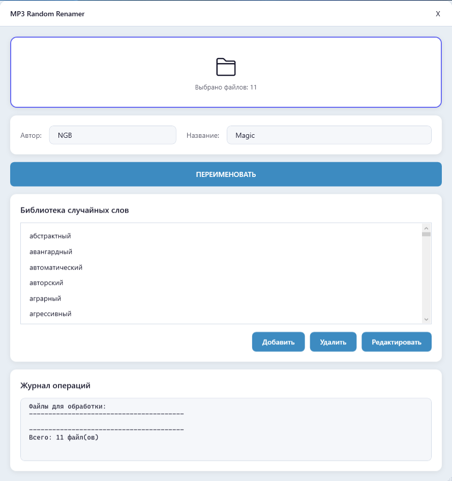

# MP3 Random Renamer




Windows Forms приложение для случайного переименования MP3-файлов с возможностью редактирования метаданных.

## Возможности

- **Drag & Drop** — перетаскивайте MP3-файлы прямо в окно приложения
- **Случайное переименование** — файлы получают случайные имена из вашего списка
- **Редактирование метаданных** — изменение автора и названия в тегах MP3
- **Настраиваемый список имён** — добавляйте, удаляйте и редактируйте имена для переименования
- **Логирование** — отслеживайте все выполненные операции

## Технологии

- .NET 8 (Windows Forms)
- TagLibSharp — для работы с метаданными MP3-файлов

## Сборка

```bash
dotnet build
```

Для публикации как единого исполняемого файла:

```bash
dotnet publish -c Release
```

## Использование

1. Запустите приложение
2. Перетащите MP3-файлы в область перетаскивания
3. Укажите автора (по умолчанию "NGB")
4. Выберите или отредактируйте список имён
5. Нажмите кнопку переименования

Список имён хранится в файле [`names.txt`](names.txt) в папке приложения.

## Лицензия

MIT License. Приложение сгенерировано нейросетями.
