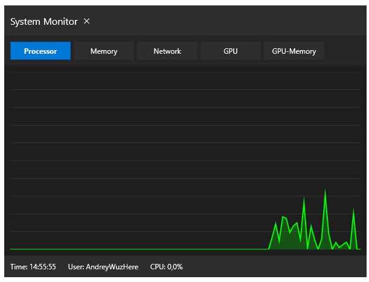
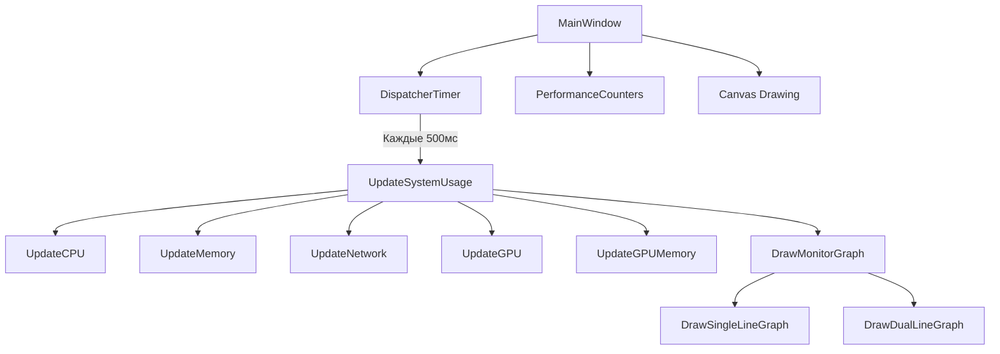
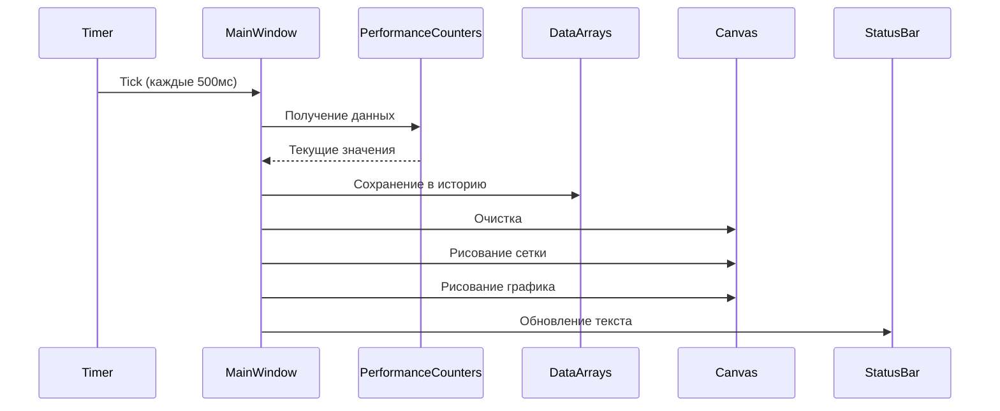

# Системный Монитор



[](https://dotnet.microsoft.com/)
[](https://docs.microsoft.com/en-us/dotnet/desktop/wpf/)
[](https://opensource.org/licenses/MIT)

**Системный Монитор** - это современное приложение для мониторинга системных ресурсов в реальном времени, аналогичное диспетчеру задач Windows, но с расширенными возможностями и современным интерфейсом.

## 📌 Оглавление

- [Описание](#-описание)
- [Функциональность](#-функциональность)
- [Требования](#-требования)
- [Сборка проекта](#-сборка-проекта)
- [Запуск приложения](#-запуск-приложения)
- [Публикация](#-публикация)
- [Архитектура](#-архитектура)
- [Логика работы](#-логика-работы)
- [Технические детали](#-технические-детали)
- [Лицензия](#-лицензия)

## 📋 Описание

**Системный Монитор** - это WPF-приложение на C#, которое предоставляет визуальный мониторинг основных системных ресурсов компьютера. Приложение имеет современный интерфейс с темной темой и поддерживает перетаскивание окна за любую область.

## ✨ Функциональность

### Режимы мониторинга

1. **🖥️ Processor** - Мониторинг загрузки CPU
   - Отображение процентной загрузки процессора
   - График с историей 100 точек
   - Цвет: Лаймовый

2. **💾 Memory** - Мониторинг использования памяти
   - Отображение процента использованной памяти
   - График с историей 100 точек
   - Цвет: Голубой

3. **🌐 Network** - Мониторинг сетевого трафика
   - Двухцветный график (входящий/исходящий трафик)
   - Отображение скорости в KB/s
   - Цвета: Зеленый (входящий), Оранжевый (исходящий)

4. **🎮 GPU** - Мониторинг загрузки видеокарты
   - Отображение процентной загрузки GPU
   - График с историей 100 точек
   - Цвет: Оранжевый

5. **🎮 GPU-Memory** - Мониторинг памяти видеокарты
   - Отображение использования памяти GPU в MB
   - График с историей 100 точек
   - Цвет: Розовый

### Особенности интерфейса

- **Перетаскиваемое окно** - можно перетаскивать за любую область
- **Темная тема** - современный темный интерфейс
- **Адаптивные графики** - автоматически подстраиваются под размер окна
- **Реальное время** - обновление данных каждые 500 мс
- **Статусная строка** - отображение текущего времени, пользователя и показателей

## 📦 Требования

- **Операционная система**: Windows 10/11
- **.NET**: Версия 10.0 или выше
- **Аппаратное обеспечение**: Процессор, память, сетевая карта
- **GPU**: Опционально (для мониторинга GPU)

## 🔧 Сборка проекта

### Предварительные требования

1. Установите [.NET SDK 10.0](https://dotnet.microsoft.com/download)
2. Клонируйте репозиторий или скачайте исходный код
3. Откройте проект в Visual Studio 2022 или новее

### Сборка из командной строки

```bash
# Перейти в директорию проекта
cd MyConsoleApp1

# Восстановить зависимости
dotnet restore

# Собрать проект в режиме Debug (для разработки)
dotnet build

# Собрать проект в режиме Release (для публикации)
dotnet build --configuration Release
```

### Сборка в Visual Studio

1. Откройте решение `MyConsoleApp1.sln` в Visual Studio
2. Выберите конфигурацию сборки:
   - `Debug` - для разработки и отладки
   - `Release` - для финальной версии
3. Нажмите `Ctrl+Shift+B` или выберите `Build > Build Solution`

## ▶️ Запуск приложения

### Запуск из Visual Studio

1. Выберите проект `MyConsoleApp1` в качестве стартового
2. Нажмите `F5` или выберите `Debug > Start Debugging`
3. Приложение запустится в режиме отладки

### Запуск из командной строки

```bash
# Перейти в директорию сборки
cd MyConsoleApp1\bin\Debug\net10.0-windows

# Запустить приложение
.\MyConsoleApp1.exe
```

### Запуск опубликованной версии

```bash
# Перейти в директорию публикации
cd publish

# Запустить приложение
.\MyConsoleApp1.exe
```

## 📦 Публикация

### Публикация для распространения

```bash
# Опубликовать проект в папку publish
dotnet publish MyConsoleApp1 --configuration Release --output ./publish

# Для автономного приложения (включает .NET runtime)
dotnet publish MyConsoleApp1 --configuration Release --output ./publish --self-contained true --runtime win-x64
```

### Структура опубликованного приложения

```
publish/
├── MyConsoleApp1.deps.json      # Файл зависимостей
├── MyConsoleApp1.dll            # Основная сборка
├── MyConsoleApp1.exe            # Исполняемый файл
├── MyConsoleApp1.pdb            # Отладочная информация (опционально)
└── MyConsoleApp1.runtimeconfig.json # Конфигурация среды выполнения
```

### Варианты упаковки

1. **Простая папка** - скопировать все файлы из `publish`
2. **ZIP-архив** - запаковать папку `publish` в архив
3. **Установщик** - создать MSI с помощью WiX Toolset
4. **ClickOnce** - использовать встроенную технологию развертывания

## 🏗️ Архитектура

### Основные компоненты



### Кольцевой буфер данных

Приложение использует кольцевой буфер для хранения 100 последних значений каждого показателя:

```csharp
private double[] _cpuUsageHistory = new double[100];
private int _currentIndex = 0;

// Добавление нового значения
_cpuUsageHistory[_currentIndex] = cpuUsage;
_currentIndex = (_currentIndex + 1) % 100;
```

## 🔄 Логика работы

### Инициализация

1. **Создание массивов истории** - инициализация массивов для хранения данных
2. **Настройка таймера** - установка интервала обновления 500 мс
3. **Первоначальное обновление** - получение первых данных
4. **Рисование графика** - отображение начального состояния

### Основной цикл



### Обработка ошибок

Приложение имеет надежную систему обработки ошибок:

1. **Проверка доступности счетчиков** - если счетчики недоступны, используются резервные данные
2. **Генерация тестовых данных** - создание реалистичных данных для демонстрации
3. **Исключения** - все исключения перехватываются и отображаются в статусной строке

## 💻 Технические детали

### Используемые технологии

- **Язык**: C# 10.0
- **Фреймворк**: .NET 10.0
- **Интерфейс**: WPF (Windows Presentation Foundation)
- **Мониторинг**: PerformanceCounter
- **Графика**: Canvas, Polyline, TextBlock

### Основные классы и методы

**MonitorMode** - перечисление режимов мониторинга:
```csharp
public enum MonitorMode
{
    CPU, Memory, Network, GPU, GPU_Memory
}
```

**MainWindow** - главное окно приложения:
```csharp
public partial class MainWindow : Window
{
    // Основные методы
    public MainWindow() { /* Инициализация */ }
    private void UpdateTimer_Tick(object sender, EventArgs e) { /* Обновление */ }
    private void UpdateSystemUsage() { /* Получение данных */ }
    private void DrawMonitorGraph() { /* Рисование графика */ }
    private void SwitchToMode(MonitorMode mode) { /* Переключение режимов */ }
}
```

### Цветовая схема

| Режим | Цвет линии | Цвет заполнения |
|-------|------------|-----------------|
| CPU | Lime | RGBA(0, 255, 0, 60%) |
| Memory | Cyan | RGBA(0, 255, 255, 60%) |
| Network In | Lime | - |
| Network Out | Orange | - |
| GPU | Orange | RGBA(255, 165, 0, 60%) |
| GPU Memory | Pink | RGBA(255, 192, 203, 60%) |

## 📊 Performance Counters

Приложение использует следующие счетчики производительности:

| Ресурс | Категория | Счетчик | Инстанс |
|--------|-----------|---------|---------|
| CPU | Processor | % Processor Time | _Total |
| Memory | Memory | % Committed Bytes In Use | - |
| Network | Network Interface | Bytes Received/sec | [Interface] |
| Network | Network Interface | Bytes Sent/sec | [Interface] |
| GPU | GPU Engine | Utilization Percentage | _Total |
| GPU Memory | GPU Process Memory | Dedicated Usage | _Total |

## 🎨 Интерфейс пользователя

### Структура XAML

```xml
<Window>
    <Grid>
        <Grid.RowDefinitions>
            <RowDefinition Height="Auto"/>  <!-- Title Bar -->
            <RowDefinition Height="Auto"/>  <!-- Tabs -->
            <RowDefinition Height="*"/>     <!-- Graph Area -->
            <RowDefinition Height="Auto"/>  <!-- Status Bar -->
        </Grid.RowDefinitions>

        <!-- Title Bar -->
        <Border Grid.Row="0">
            <StackPanel>
                <TextBlock Text="System Monitor"/>
                <Button Content="✕" Click="CloseButton_Click"/>
            </StackPanel>
        </Border>

        <!-- Tabs -->
        <Border Grid.Row="1">
            <StackPanel>
                <Button Content="Processor" Click="CpuTabButton_Click"/>
                <Button Content="Memory" Click="MemoryTabButton_Click"/>
                <Button Content="Network" Click="NetworkTabButton_Click"/>
                <Button Content="GPU" Click="GpuTabButton_Click"/>
                <Button Content="GPU-Memory" Click="GpuMemoryTabButton_Click"/>
            </StackPanel>
        </Border>

        <!-- Graph Area -->
        <Border Grid.Row="2">
            <Canvas x:Name="MonitorCanvas"/>
        </Border>

        <!-- Status Bar -->
        <Border Grid.Row="3">
            <StackPanel>
                <TextBlock x:Name="TimeText"/>
                <TextBlock x:Name="UserText"/>
                <TextBlock x:Name="SystemInfoText"/>
            </StackPanel>
        </Border>
    </Grid>
</Window>
```

## 📝 Лицензия

Этот проект распространяется под лицензией MIT. Подробности смотрите в файле LICENSE.

---

**🎉 Приложение готово к использованию!** 🎉

Для вопросов и предложений создавайте Issues в репозитории или свяжитесь с разработчиком.