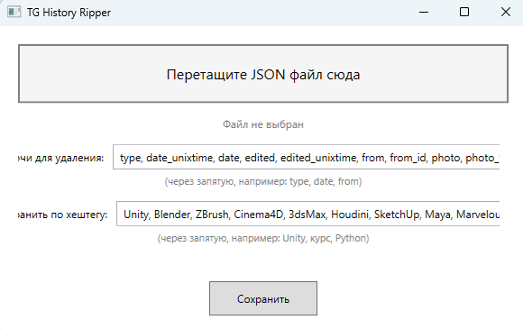

# TG History Ripper

WPF-приложение для извлечения и категоризации ссылок из экспорта истории чатов Telegram.

## Возможности

- Перетаскивание JSON-файла в окно приложения
- Удаление ненужных полей из JSON (метаданные, медиа и т.д.)
- Извлечение ссылок и названий из сообщений
- Экспорт по хештегам в Markdown-файлы с группировкой по категориям
- Автоматическое создание `.old` бэкапа

## Категории

Программа автоматически сортирует ссылки по категориям:
- Курсы
- Демо
- Окружения
- Модели/Пропсы
- Персонажи
- Анимации
- Плагины/Инструменты
- Материалы/Текстуры
- Книги
- Наборы ассетов
- Прочее

## Поля по умолчанию

```
type, date_unixtime, date, edited, edited_unixtime, from, from_id, photo, photo_file_size, width, height, text_entities, reactions, file, file_name, file_size, thumbnail, thumbnail_file_size, media_type, duration_seconds
```

## Хештеги по умолчанию

```
Unity, Blender, ZBrush, Cinema4D, 3dsMax, Houdini, SketchUp, Maya, Marvelous, эффекты, курс, модель, текстура, звук, Unreal, Substance
```

## Как использовать

1. Перетащите JSON-файл в окно приложения
2. Отредактируйте список ключей для удаления (или оставьте по умолчанию)
3. При необходимости измените список хештегов для экспорта
4. Нажмите "Сохранить"

Программа:
- Удаляет указанные поля из основного файла
- Создаёт `.old` бэкап оригинального файла
- Для каждого хештега создаёт Markdown-файл с категориями (например, `result_Unreal.md`)

## Пример вывода

```markdown
## Курсы

- [The Environment Kit](https://t.me/234)
- [Create Next Gen for Engine](https://t.me/123)

## Модели/Пропсы

- [Low Poly Tree Pack](https://t.me/345)
```

## Требования

- .NET 10.0 (или новее)
- Windows

## Сборка

```bash
dotnet build
dotnet run
```
