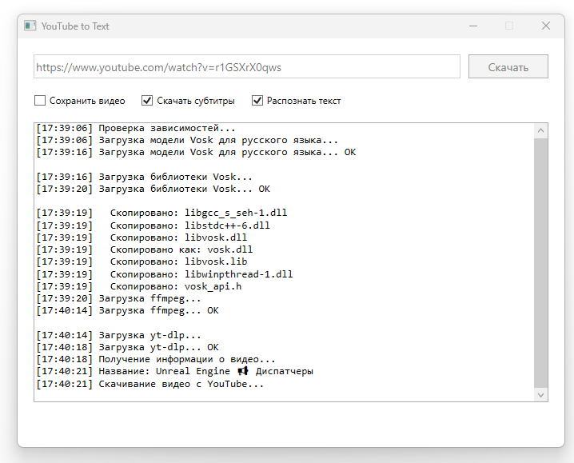

# YTVtoText - YouTube Video to Text



Приложение для скачивания видео с YouTube и распознавания текста из аудио дорожки.

## Возможности

- Скачивание видео с YouTube в минимальном качестве
- Распознавание речи с помощью нейросети Vosk
- Сохранение распознанного текста в TXT файл
- Автоматическая загрузка необходимых зависимостей (модель Vosk, ffmpeg)
- Все зависимости встроены в один EXE файл

## Использование

1. **Запустите приложение**

2. **Вставьте ссылку** на YouTube видео в поле ввода

3. **Нажмите кнопку "Скачать"**

4. **Дождитесь завершения** процесса:
   - Загрузка модели Vosk (при первом запуске, ~50 МБ)
   - Загрузка ffmpeg (при первом запуске, ~100 МБ)
   - Загрузка yt-dlp (при первом запуске, ~10 МБ)
   - Скачивание видео
   - Декодирование аудио
   - Распознавание текста
   - Сохранение результата

5. **Результат** будет сохранён в файле `{название_видео}_text.txt` рядом с приложением

## Структура файлов

После первого запуска рядом с приложением появятся:
- `vosk-model-small-ru-0.22/` - модель для распознавания русской речи
- `vosk.dll` - библиотека Vosk
- `ffmpeg.exe` - утилита для конвертации аудио
- `{название_видео}_text.txt` - распознанный текст

## Требования

- Windows x64
- .NET 8.0 Runtime (встроено в приложение)

## Сборка

```bash
dotnet build -c Release
```

Для публикации:

```bash
dotnet publish -c Release -o publish
```

## Примечания

- При первом запуске приложение загрузит:
  - Модель Vosk (~50 МБ)
  - ffmpeg (~100 МБ)
  - yt-dlp (~10 МБ)
- Распознавание работает только с русским языком
- Видео после обработки удаляется (сохраняется только текст)
